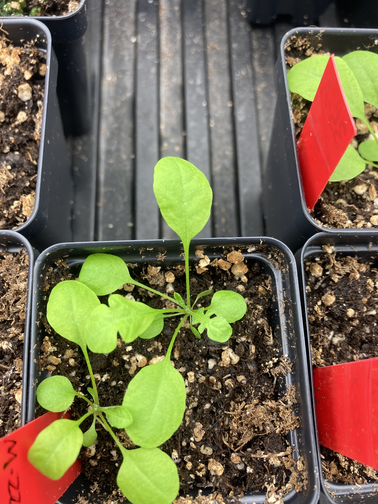
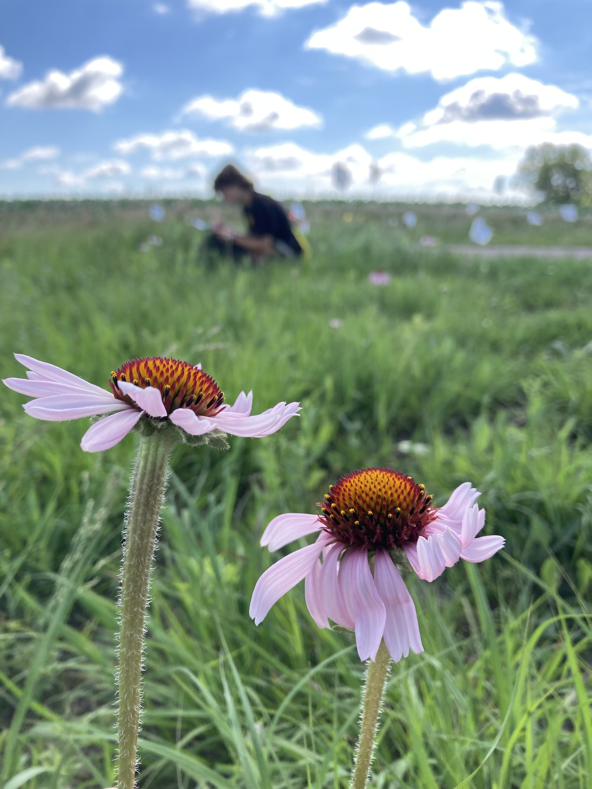

<iframe width="300" height="154" src="https://w2.countingdownto.com/6216692" frameborder="0"></iframe>

# Research interests:
I am broadly interested in how plants sense and respond to their environment. I am cruious how ecological and evolutionary factors effect what traits we see on the landscape. During my PhD work I am looking at how hybridization which shifts the plant traits effect the interactions plants have with herbivores and pollinators.

Before starting grad school I was a lab manager in two different labs. [Josephs' lab](https://josephslab.github.io/) at Michigan State University studying *Capsella bursa-pastoris* and I was with the [Echinacea Project](https://echinaceaproject.org/) studying habitat fragmentation of the tallgrass prarie. 

  |   
:-------------------------:|:-------------------------:
*Capsella bursa-pastoris*   |  *Echinacea angustifolia*

I completed my BA at The College of Wooster. I completed my senior thesis with [Dr. Jennifer L Ison](https://isonlab.voices.wooster.edu/) studying spatial genetic structure of *Erythrina flabelliformis* a hummingbird-pollinated desert perennial.

*Mia contemplates life while in a prairie remnant*
