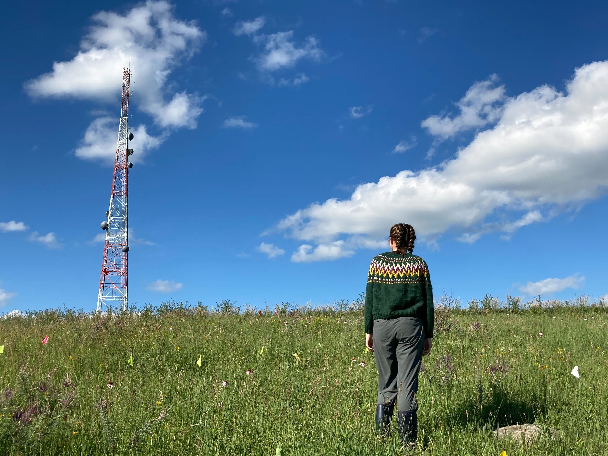

I am currently a lab manager in the [Josephs' lab](https://josephslab.github.io/) at Michigan State University studying *Capsella bursa-pastoris*. Before then I was with the [Echinacea Project](https://echinaceaproject.org/) studying habitat fragmentation of the tallgrass prarie. 

I completed my BA at The College of Wooster. I completed my senior thesis with [Dr. Jennifer L Ison](https://isonlab.voices.wooster.edu/) studying spatial genetic structure of *Erythrina flabelliformis* a hummingbird-pollinated desert perennial.

# Research interests:
I am broadly interested in how plants sense and respond to their environment. I mainly have been coming at this from a pollination biology direction.

